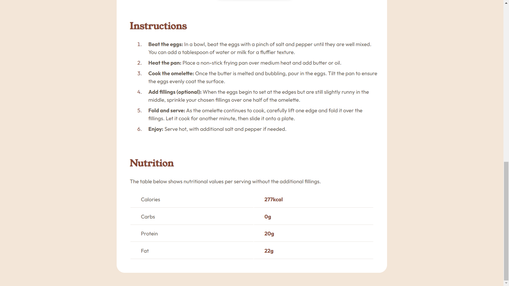

# Frontend Mentor - Recipe page solution

This is a solution to the [Recipe page challenge on Frontend Mentor](https://www.frontendmentor.io/challenges/recipe-page-KiTsR8QQKm).

## Table of contents

- [Overview](#overview)
  - [Screenshot](#screenshot)
  - [Links](#links)
- [My process](#my-process)
  - [Built with](#built-with)
  - [What I learned](#what-i-learned)
- [Author](#author)

## Overview

### Screenshots





### Links

- [Frontend Mentor Solution](https://www.frontendmentor.io/solutions/simple-page-with-html-and-scss-FRSHxD2oRb)
- [Live Site](https://helsel-recipe-page.netlify.app/)

## My process

### Built with

- Semantic HTML5 markup
- SCSS
- Flexbox
- Mobile-first workflow

### What I learned

This was largely a simple project to get back into web dev as I haven't been very active in a while due to school and a game dev project. That being said, there were a few new things to me here.

I have no idea why, but I have somehow never worked with tables before this. There were certainly some quirks when it comes to styling them, but it did become intuitive when I did a little research. In fact, the styling for the entire table was very simple:

```SCSS
table{
    width: 100%;

    tr {
        height: 50px;
    }

    td {
        border-bottom: 1px solid $light-grey;
        padding-left: 32px;
    }

    td + td {
        color: $nutmeg;
        font-weight: 700;
    }
}
```

Just some simple rules to get it looking like the Figma design along with a rule that takes advantage of the table structure to make the second cell in each row have different text styles.

The other area where I had to do a little research is styling the bullets and numbers for lists. Styling the bullet number color was super simple, the ::marker pseudo element was great to learn about and a useful tool in my belf for the future.

```SCSS
li::marker {
    color: $nutmeg;
}
```

I was surprised to learn I couldn't give that same pseudo element a margin to push the following text away. The best solution I could find online was to put the actual `<li>` text in a `<span>` and then give that element a relative position.

```SCSS
li > span {
    position: relative;
    left: 16px;
}
```

The solution feels clean and simple enough, so I am happy about it, but I'd love to learn if there's a better way in the future.


## Author

- Website - [Jeremy Helsel](https://www.jeremyhelsel.com)
- Frontend Mentor - [@JIH7](https://www.frontendmentor.io/profile/JIH7)

